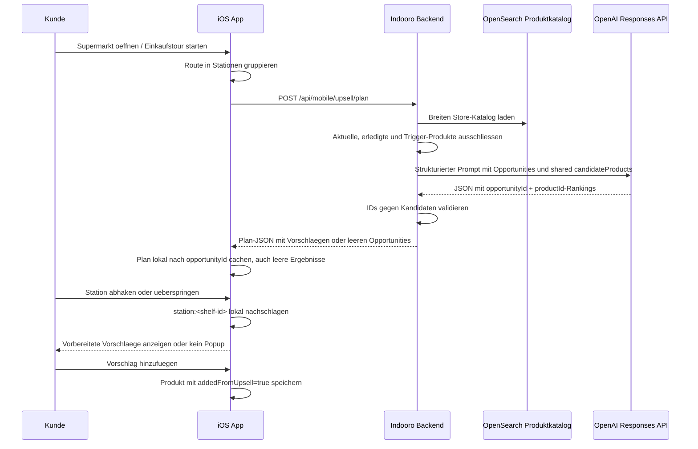

# AI Upsell Flow

## Ablauf



## Request Vom Client An Das Backend

Die App sendet keinen OpenAI-Key. Sie sendet nur die aktuelle Store-/Listen-/Stations-Situation:

```json
{
  "storeId": "bbbbbbbb-bbbb-bbbb-bbbb-bbbbbbbbbbbb",
  "storeCode": "demo-store",
  "shoppingListId": "local-list-uuid",
  "currentListProductIds": [1, 3, 8],
  "completedProductIds": [],
  "source": "shopping_session",
  "opportunities": [
    {
      "opportunityId": "station:shelf-430",
      "triggerProductIds": [1, 3],
      "triggerProductNames": ["Spaghetti", "Tomatensauce"]
    },
    {
      "opportunityId": "station:shelf-525",
      "triggerProductIds": [8],
      "triggerProductNames": ["Parmesan"]
    }
  ]
}
```

## Prompt An OpenAI

System:

```text
You are ranking supermarket add-on products for each shopping station. The server provides a shared candidateProducts catalog for this store. For each opportunity, decide from scratch which candidate productIds are genuinely useful complements for the trigger products. Return an empty suggestions array when nothing clearly fits. Select only productIds from candidateProducts and only opportunityIds from opportunities. Do not invent products or opportunityIds. Reasons must be concise German customer-facing text.
```

User-Payload:

```json
{
  "opportunities": [
    {
      "opportunityId": "station:shelf-430",
      "triggerProductIds": [1, 3],
      "triggerProductNames": ["Spaghetti", "Tomatensauce"]
    }
  ],
  "candidateProducts": [
    {
      "id": 2,
      "name": "Parmesan",
      "categoryCode": "525",
      "layoutCode": "525/1/1/1",
      "hasLayoutPosition": true
    },
    {
      "id": 9,
      "name": "Kuechenrolle 4 Rollen",
      "categoryCode": "820",
      "layoutCode": "820/1/1/1",
      "hasLayoutPosition": true
    }
  ],
  "maxSuggestionsPerOpportunity": 3
}
```

## Erwartete OpenAI-Antwort

OpenAI muss strikt JSON liefern und darf nur IDs aus dem Payload verwenden:

```json
{
  "opportunities": [
    {
      "opportunityId": "station:shelf-430",
      "suggestions": [
        {
          "productId": 2,
          "reason": "Passt gut zu Pasta und Sauce.",
          "confidence": 0.82
        }
      ]
    }
  ]
}
```

Wenn nichts klar passt:

```json
{
  "opportunities": [
    {
      "opportunityId": "station:shelf-525",
      "suggestions": []
    }
  ]
}
```

## Antwort Vom Backend An Die App

Das Backend ersetzt die AI-IDs durch echte Katalogprodukte und filtert ungueltige IDs, bereits gelistete Produkte, erledigte Produkte und Trigger-Produkte:

```json
{
  "source": "openai",
  "expiresAt": "2026-06-25T10:30:00Z",
  "debug": {
    "requestId": "a-runtime-uuid",
    "model": "gpt-5.4-mini",
    "responseSource": "openai",
    "elapsedMs": 4200,
    "openAiElapsedMs": 3900,
    "inputTokens": 1800,
    "outputTokens": 140,
    "totalTokens": 1940,
    "cachedInputTokens": 0,
    "reasoningTokens": 0,
    "fallbackReason": null,
    "opportunityCount": 2,
    "candidateCount": 150
  },
  "opportunities": [
    {
      "opportunityId": "station:shelf-430",
      "triggerProductIds": [1, 3],
      "suggestions": [
        {
          "product": {
            "id": 2,
            "name": "Parmesan",
            "price": 2.49,
            "layoutCode": "525/1/1/1",
            "storeId": "bbbbbbbb-bbbb-bbbb-bbbb-bbbbbbbbbbbb",
            "storeCode": "demo-store",
            "brand": null,
            "category": "525",
            "imageUrl": null,
            "hasLayoutPosition": true
          },
          "reason": "Passt gut zu Pasta und Sauce.",
          "confidence": 0.82
        }
      ]
    }
  ]
}
```

## Timeout-Verhalten

- Backend OpenAI Timeout: `OPENAI_UPSELL_TIMEOUT_MS=12000`.
- iOS Plan Timeout: `25` Sekunden.
- iOS startet keinen zweiten Plan-Request, solange ein Plan-Request laeuft.
- Wenn OpenAI nicht rechtzeitig oder nicht gueltig antwortet, gibt das Backend leere Suggestions zurueck statt Server-Fallback.

## Wichtige Schutzregeln

- OpenAI-Key liegt nur im Backend als Secret/Env, nie in Swift.
- AI bekommt einen breiteren, aber weiterhin begrenzten Store-Katalog, nicht ungefilterte Secrets oder Admin-Daten.
- AI darf keine Produkte erfinden; unbekannte `productId` werden verworfen.
- Bereits offene, erledigte und Trigger-Produkte werden serverseitig ausgeschlossen.
- Stationen werden ueber `opportunityId` gebunden, dadurch kann keine alte Antwort fuer eine andere Station erscheinen.
- iOS cached leere Opportunities als `loaded_empty`; spaeteres Abhaken fuehrt dann zu `no_suggestions` statt `cache_miss`.
- Produkte, die aus Vorschlaegen hinzugefuegt wurden, bekommen `addedFromUpsell=true` und triggern keine neue Upsell-Suche.
- Debug-Ausgaben verwenden in iOS den Prefix `[UpsellDebug]`; Backend-Logs enthalten Request-ID, Source, Dauer und Token-Usage, aber keinen API-Key.
