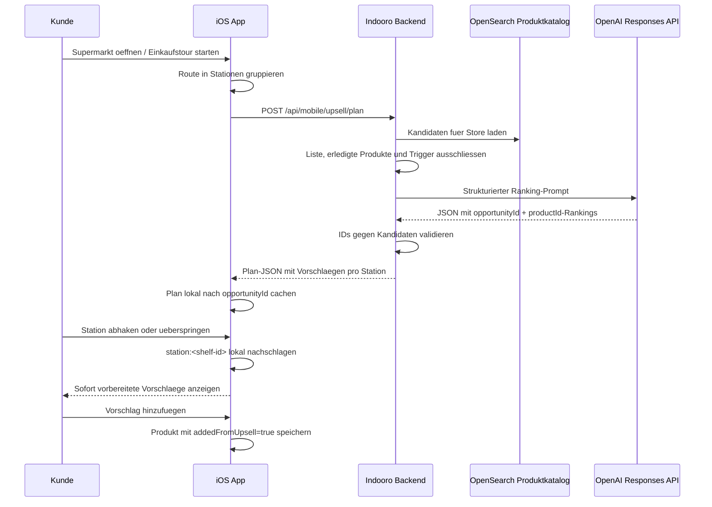

# AI Upsell Flow

## Ablauf



## Request vom Client an das Backend

Die App sendet keinen OpenAI-Key. Sie sendet nur die aktuelle Store-/Listen-/Stations-Situation:

```json
{
  "storeId": "bbbbbbbb-bbbb-bbbb-bbbb-bbbbbbbbbbbb",
  "storeCode": "demo-store",
  "shoppingListId": "local-list-uuid",
  "currentListProductIds": [1, 3, 8],
  "completedProductIds": [],
  "source": "shopping_session",
  "opportunities": [
    {
      "opportunityId": "station:shelf-430",
      "triggerProductIds": [1, 3],
      "triggerProductNames": ["Spaghetti", "Tomatensauce"]
    },
    {
      "opportunityId": "station:shelf-525",
      "triggerProductIds": [8],
      "triggerProductNames": ["Parmesan"]
    }
  ]
}
```

## Prompt an OpenAI

System:

```text
Rank supermarket add-on products for each shopping station. Select only productIds from candidateProducts and only opportunityIds from opportunities. Do not invent products or opportunityIds. Reasons must be concise German customer-facing text.
```

User-Payload:

```json
{
  "opportunities": [
    {
      "opportunityId": "station:shelf-430",
      "triggerProductIds": [1, 3],
      "triggerProductNames": ["Spaghetti", "Tomatensauce"]
    }
  ],
  "candidateProducts": [
    {
      "id": 2,
      "name": "Basilikum",
      "categoryCode": "310",
      "layoutCode": "310/1/1/1",
      "hasLayoutPosition": true
    }
  ],
  "maxSuggestionsPerOpportunity": 3
}
```

## Erwartete OpenAI-Antwort

OpenAI muss strikt JSON liefern und darf nur IDs aus dem Payload verwenden:

```json
{
  "opportunities": [
    {
      "opportunityId": "station:shelf-430",
      "suggestions": [
        {
          "productId": 2,
          "reason": "Passt gut zu Pasta und Sauce.",
          "confidence": 0.82
        }
      ]
    }
  ]
}
```

## Antwort vom Backend an die App

Das Backend ersetzt die AI-IDs durch echte Katalogprodukte, filtert ungueltige IDs, bereits gelistete Produkte und Trigger-Produkte:

```json
{
  "source": "openai",
  "expiresAt": "2026-06-03T10:30:00Z",
  "opportunities": [
    {
      "opportunityId": "station:shelf-430",
      "triggerProductIds": [1, 3],
      "suggestions": [
        {
          "product": {
            "id": 2,
            "name": "Basilikum",
            "price": 1.29,
            "layoutCode": "310/1/1/1",
            "storeId": "bbbbbbbb-bbbb-bbbb-bbbb-bbbbbbbbbbbb",
            "storeCode": "demo-store",
            "brand": null,
            "category": "310",
            "imageUrl": null,
            "hasLayoutPosition": true
          },
          "reason": "Passt gut zu Pasta und Sauce.",
          "confidence": 0.82
        }
      ]
    }
  ]
}
```

## Wichtige Schutzregeln

- OpenAI-Key liegt nur im Backend als Secret/Env, nie in Swift.
- AI darf keine Produkte erfinden; unbekannte `productId` werden verworfen.
- Bereits offene, erledigte und Trigger-Produkte werden ausgeschlossen.
- Stationen werden ueber `opportunityId` gebunden, dadurch kann keine alte Antwort fuer eine andere Station erscheinen.
- Produkte, die aus Vorschlaegen hinzugefuegt wurden, bekommen `addedFromUpsell=true` und triggern keine neue Upsell-Suche.
