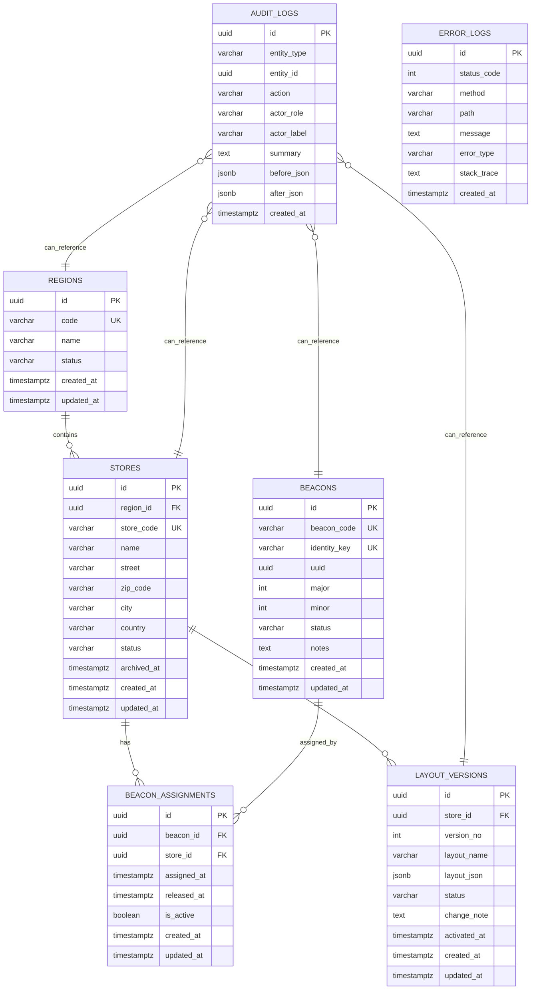
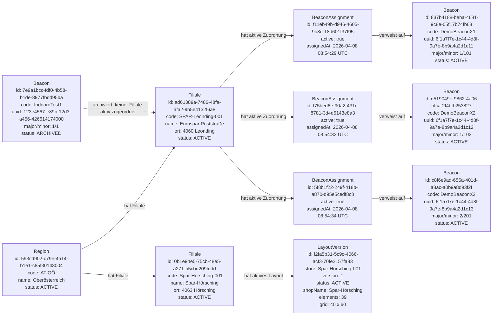
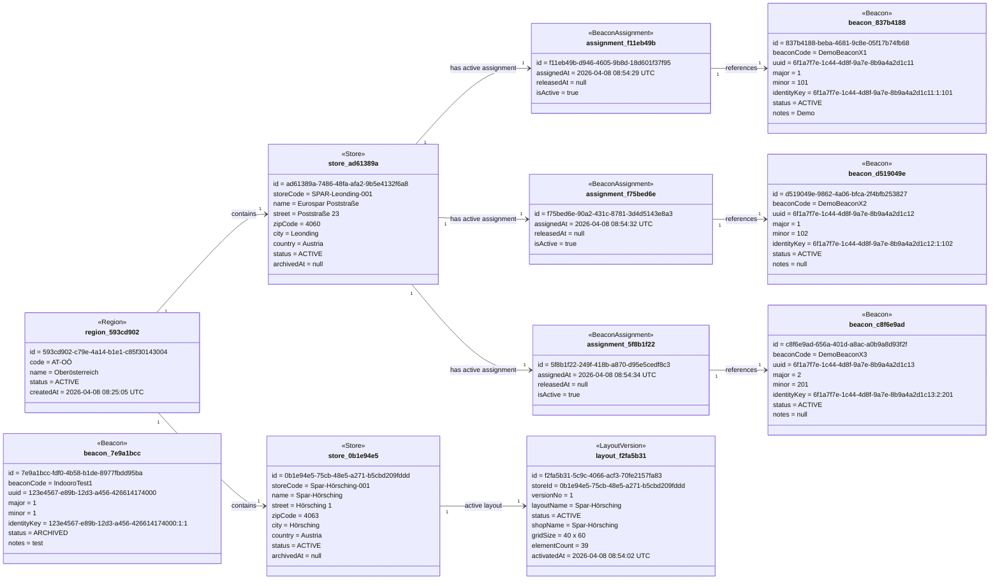
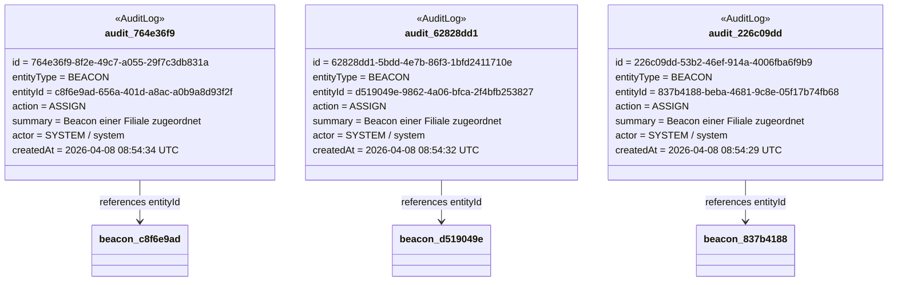
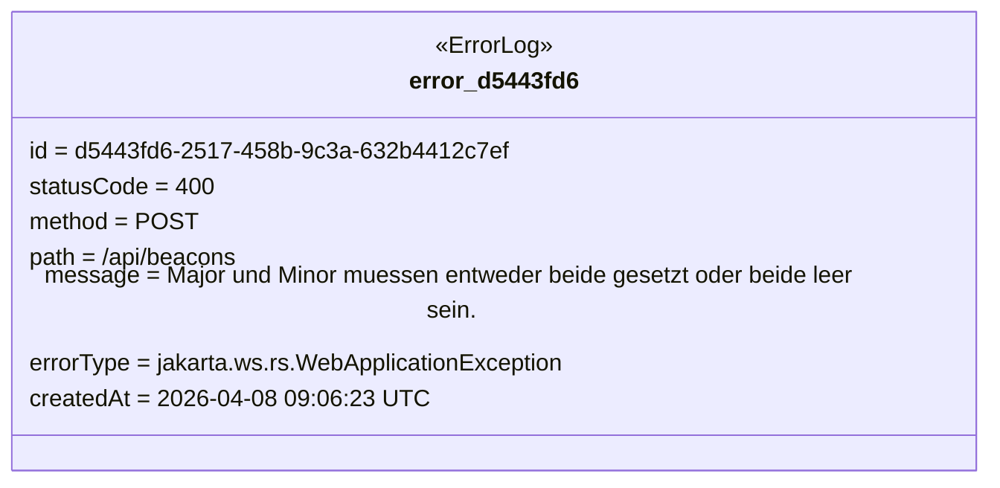

# Indooro Laufzeit-Objektdiagramm der Datenbank

Stand: 2026-04-15

Dieses Dokument zeigt die aktuelle Datenbankstruktur nicht nur abstrakt, sondern als Laufzeit-Objektdiagramm mit echten Werten aus der LeoCloud-PostgreSQL-Datenbank.

Quelle der Daten:

- Kubernetes Namespace: `student-it220209`
- PostgreSQL Pod: `postgres-679889fbd6-mwcgk`
- Datenbank: `indooro`
- Zeitpunkt der Abfrage: 2026-04-15

## 1. Aktueller Tabellenstand

| Tabelle | Anzahl Datensaetze |
|---|---:|
| `regions` | 1 |
| `stores` | 2 |
| `beacons` | 4 |
| `beacon_assignments` | 3 |
| `layout_versions` | 1 |
| `audit_logs` | 12 |
| `error_logs` | 1 |

## 2. ER-Diagramm der Datenbankstruktur

Dieses Diagramm zeigt die strukturellen Beziehungen der Tabellen.



## 3. Laufzeit-Objektdiagramm mit echten Werten

Dieses Diagramm zeigt konkrete Objektinstanzen aus der aktuellen Datenbank.

### 3.1 Kompakte Laufzeitansicht

Diese Darstellung ist fuer die Sprint-Demo am einfachsten zu erklaeren: Jede Box ist ein echtes Objekt aus der Datenbank.



### 3.2 Detailliertes Objektdiagramm



## 4. Laufzeit-Interpretation

### 4.1 Region

Aktuell gibt es genau eine Region:

| Region-ID | Code | Name | Status |
|---|---|---|---|
| `593cd902-c79e-4a14-b1e1-c85f30143004` | `AT-OÖ` | `Oberösterreich` | `ACTIVE` |

Diese Region enthaelt beide Filialen.

### 4.2 Filialen

| Store-ID | Store-Code | Name | Ort | Status |
|---|---|---|---|---|
| `ad61389a-7486-48fa-afa2-9b5e4132f6a8` | `SPAR-Leonding-001` | `Eurospar Poststraße` | `Leonding` | `ACTIVE` |
| `0b1e94e5-75cb-48e5-a271-b5cbd209fddd` | `Spar-Hörsching-001` | `Spar-Hörsching` | `Hörsching` | `ACTIVE` |

### 4.3 Beacons

| Beacon-ID | Code | UUID | Major | Minor | Status |
|---|---|---|---:|---:|---|
| `7e9a1bcc-fdf0-4b58-b1de-8977fbdd95ba` | `IndooroTest1` | `123e4567-e89b-12d3-a456-426614174000` | 1 | 1 | `ARCHIVED` |
| `837b4188-beba-4681-9c8e-05f17b74fb68` | `DemoBeaconX1` | `6f1a7f7e-1c44-4d8f-9a7e-8b9a4a2d1c11` | 1 | 101 | `ACTIVE` |
| `d519049e-9862-4a06-bfca-2f4bfb253827` | `DemoBeaconX2` | `6f1a7f7e-1c44-4d8f-9a7e-8b9a4a2d1c12` | 1 | 102 | `ACTIVE` |
| `c8f6e9ad-656a-401d-a8ac-a0b9a8d93f2f` | `DemoBeaconX3` | `6f1a7f7e-1c44-4d8f-9a7e-8b9a4a2d1c13` | 2 | 201 | `ACTIVE` |

### 4.4 Aktive Beacon-Zuordnungen

Aktuell sind drei Beacons aktiv der Filiale `SPAR-Leonding-001` zugeordnet.

| Assignment-ID | Beacon | Filiale | Aktiv |
|---|---|---|---|
| `f11eb49b-d946-4605-9b8d-18d601f37f95` | `DemoBeaconX1` | `SPAR-Leonding-001` | `true` |
| `f75bed6e-90a2-431c-8781-3d4d5143e8a3` | `DemoBeaconX2` | `SPAR-Leonding-001` | `true` |
| `5f8b1f22-249f-418b-a870-d95e5cedf8c3` | `DemoBeaconX3` | `SPAR-Leonding-001` | `true` |

### 4.5 Layout-Version

Aktuell gibt es eine gespeicherte store-spezifische Layout-Version.

| Layout-ID | Store-Code | Version | Status | Shop-Name | Elemente |
|---|---|---:|---|---|---:|
| `f2fa5b31-5c9c-4066-acf3-70fe2157fa83` | `Spar-Hörsching-001` | 1 | `ACTIVE` | `Spar-Hörsching` | 39 |

Wichtig: Die aktive Layout-Version gehoert aktuell zur Filiale `Spar-Hörsching-001`, waehrend die aktiven Beacons aktuell der Filiale `SPAR-Leonding-001` zugeordnet sind. Das ist technisch erlaubt, bedeutet aber fachlich, dass die aktuell gespeicherten Beacon-Zuordnungen und das aktuell gespeicherte Layout auf unterschiedliche Filialen zeigen.

## 5. Audit- und Fehlerobjekte

### 5.1 Letzte Audit-Logs

Die neuesten Audit-Objekte zeigen vor allem Beacon-Zuordnungen und Layout-Aktivierung.



### 5.2 Fehlerlog-Objekt

Aktuell existiert ein Fehlerlog-Eintrag.



Dieser Fehler entstand durch einen Beacon-Create-Request, bei dem `major` gesetzt war, aber `minor` fehlte.

## 6. Fachliche Aussage des Laufzeitdiagramms

Der aktuelle Laufzeitstand sagt fachlich:

1. Es gibt eine aktive Region `Oberösterreich`.
2. Diese Region verwaltet zwei aktive Filialen.
3. Es gibt vier Beacon-Objekte.
4. Drei Beacons sind aktiv und einer ist archiviert.
5. Alle drei aktiven Beacons sind aktuell `SPAR-Leonding-001` zugeordnet.
6. Eine aktive Layout-Version existiert aktuell fuer `Spar-Hörsching-001`.
7. Audit-Logs dokumentieren die letzten erfolgreichen Aktionen.
8. Error-Logs dokumentieren fehlgeschlagene API-Requests.

## 7. Relevante SQL-Abfragen

Diese Abfragen wurden genutzt, um die Werte fuer dieses Dokument zu bestimmen.

```sql
select 'regions' as table_name, count(*) from regions
union all select 'stores', count(*) from stores
union all select 'beacons', count(*) from beacons
union all select 'beacon_assignments', count(*) from beacon_assignments
union all select 'layout_versions', count(*) from layout_versions
union all select 'audit_logs', count(*) from audit_logs
union all select 'error_logs', count(*) from error_logs;
```

```sql
select id, code, name, status, created_at
from regions
order by created_at;
```

```sql
select id, region_id, store_code, name, street, zip_code, city, country, status, archived_at, created_at
from stores
order by created_at;
```

```sql
select id, beacon_code, identity_key, uuid, major, minor, status, notes, created_at
from beacons
order by created_at;
```

```sql
select ba.id, b.beacon_code, ba.beacon_id, s.store_code, ba.store_id, ba.assigned_at, ba.released_at, ba.is_active
from beacon_assignments ba
join beacons b on b.id = ba.beacon_id
join stores s on s.id = ba.store_id
order by ba.assigned_at;
```

```sql
select lv.id, s.store_code, lv.store_id, lv.version_no, lv.layout_name, lv.status,
       lv.activated_at, lv.created_at,
       jsonb_array_length(coalesce(lv.layout_json->'elements','[]'::jsonb)) as element_count,
       lv.layout_json->>'shopName' as shop_name
from layout_versions lv
join stores s on s.id = lv.store_id
order by lv.created_at;
```
